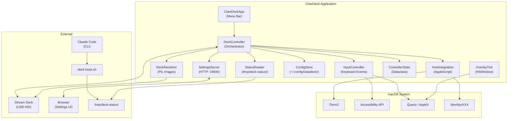
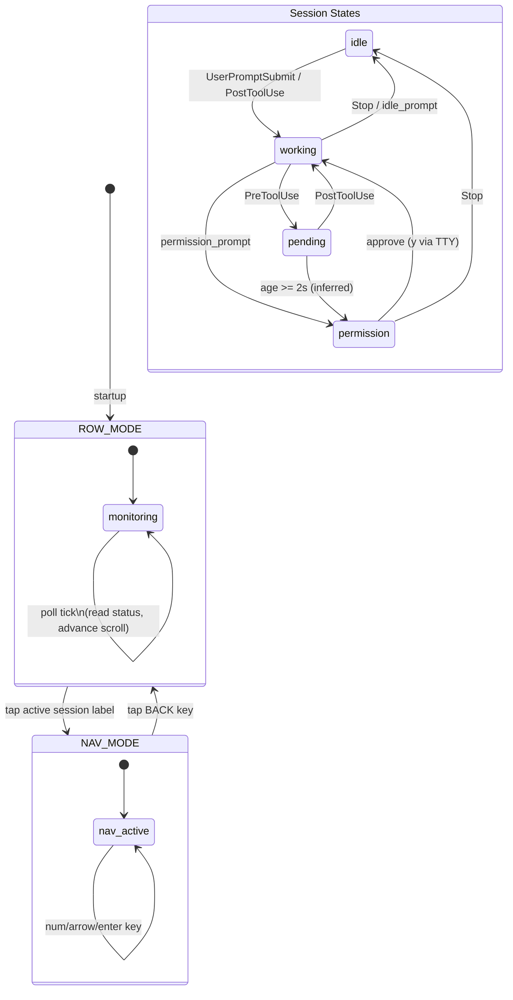

# ClawDeck UML Diagram

## Class Diagram

```mermaid
classDiagram
    direction TB

    %% ─── Core Controller ───────────────────────────────────────
    class DeckController {
        -config_store: ConfigStore
        -config: dict
        -state: ControllerState
        -deck: StreamDeck
        -running: bool
        -_lock: Lock
        -_poller: Thread
        -host: HostIntegration
        -input: InputController
        -renderer: DeckRenderer
        -status_reader: StatusReader
        -settings_server: SettingsServer
        +run()
        +startup(start_settings_server) int
        +shutdown()
        +apply_config_update(updates, save)
        +refresh_tty_map() tuple
        +update_all_buttons()
        +start_settings_server() int
        -_open_deck()
        -_load_config() dict
        -_save_config()
        -_key_to_session(key) str
        -_session_label_key(session) int
        -_key_is_label(key) bool
        -_key_info_index(key) int
        -_build_tty_map()
        -_read_status_files()
        -_format_tool_command(tool_info) str
        -_render_scroll_strip(text) Image
        -_ensure_scroll_strip(label_key) Image
        -_render_scroll_button(strip, offset, idx) Image
        -_advance_scroll_offsets() bool
        -_get_slot_style(slot) tuple
        -_draw_row_mode()
        -_draw_nav_mode()
        -_activate_session(session) bool
        -_approve_permission(session) bool
        -_on_key_change(deck, key, pressed)
        -_handle_key(key, pressed)
        -_handle_row_key(session)
        -_handle_nav_key(key)
        -_poll_active_loop()
        -_handle_command(raw)
        -_clear_status_dir()
    }

    %% ─── State ─────────────────────────────────────────────────
    class ControllerState {
        <<dataclass>>
        +mode: str
        +active_slot: int?
        +slot_tty: dict~int,str~
        +slot_cwd: dict~int,str~
        +slot_status: dict~int,str~
        +slot_tool_info: dict~int,dict~
        +scroll_offsets: dict~int,int~
        +scroll_images: dict~int,Image~
        +scroll_text: dict~int,str~
        +blink_on: bool
        +key_press_time: dict~int,float~
        +last_blink_toggle: float
        +last_tty_refresh: float
        +last_active_cwd_check: float
    }

    %% ─── Config ────────────────────────────────────────────────
    class ConfigStore {
        -path: str
        +normalize(raw) dict
        +load() dict
        +save(config)
        +apply_update(config, updates, save) dict
        +color(config, key, fallback) tuple
    }

    %% ─── Renderer ──────────────────────────────────────────────
    class DeckRenderer {
        -config_store: ConfigStore
        -font_xs: ImageFont
        -font_sm: ImageFont
        -font_md: ImageFont
        -font_lg: ImageFont
        +button_dimensions(deck) tuple
        +render_button(deck, label, bg, fg, border_color, subtitle) bytes
        +render_scroll_strip(deck, config, text) Image
        +ensure_scroll_strip(deck, state, config, label_key) Image
        +render_scroll_button(deck, strip, offset, idx) bytes
        +advance_scroll_offset(state, config, key, width) int
        +advance_scroll_offsets(deck, state, config) bool
        +get_slot_style(config, state, slot) tuple
        +get_nav_style(config, key) dict
        +draw_row_mode(deck, state, config)
        +draw_nav_mode(deck, state, config)
        +update_all_buttons(deck, state, config)
        +pick_font(label) ImageFont
        +first_display_value(value) str
        +format_tool_command(tool_info) str
        +format_cwd(config, path) str
        -_init_fonts()
    }

    %% ─── Host Integration ──────────────────────────────────────
    class HostIntegration {
        +check_accessibility() bool
        +get_iterm_sessions() list~dict~
        +resolve_tty_cwd(tty_name) str
        +build_tty_map(config) tuple
        +frontmost_session_name() str
        +get_frontmost_slot(config) int
        +activate_session(config, session) bool
        +approve_permission(tty_name) bool
    }

    %% ─── Input ─────────────────────────────────────────────────
    class InputController {
        +trigger_mic(config)
        +learn_keystroke(config, config_store)
        +send_key(key_name)
    }

    %% ─── Status ────────────────────────────────────────────────
    class StatusReader {
        +normalize_tool_info(raw) dict
        +read(slot_tty, config, formatter, scroll_text) StatusSnapshot
    }

    class StatusSnapshot {
        <<dataclass>>
        +slot_status: dict~int,str~
        +slot_tool_info: dict~int,dict~
        +clear_scroll_slots: set~int~
        +reset_scroll_slots: set~int~
    }

    %% ─── Settings Server ───────────────────────────────────────
    class SettingsServer {
        -_controller_provider: callable
        -config_store: ConfigStore
        -_server: HTTPServer
        +port: int
        +start() int
        +stop()
        -_make_handler() type
    }

    class SettingsHandler {
        <<inner class>>
        +do_GET()
        +do_POST()
        -_json_response(data, code)
    }

    %% ─── Menu Bar App ──────────────────────────────────────────
    class ClawDeckApp {
        -controller: DeckController
        -_controller_thread: Thread
        -settings_server: SettingsServer
        -_http_port: int
        +toggle_controller(sender)
        +rescan_sessions(_)
        +open_settings(_)
        +install_hooks(_)
        +quit_app(_)
        -_start_controller()
        -_stop_controller()
        -_update_menu_state(running)
    }

    %% ─── Overlay ───────────────────────────────────────────────
    class OverlayTick {
        -win: NSWindow
        -visible: bool
        -last_rect: tuple
        -last_color: tuple
        -label_win: NSWindow
        -label_field: NSTextField
        -last_cwd: str
        -label_visible: bool
        +init() OverlayTick
        +tick_(timer)
        -_update_border_color(rgb)
    }

    %% ─── Layout Module (functions) ─────────────────────────────
    class layout {
        <<module>>
        +key_to_session(key) str$
        +session_label_key(session) int$
        +key_is_label(key) bool$
        +key_info_index(key) int$
    }

    %% ─── External Dependencies ─────────────────────────────────
    class StreamDeck {
        <<external>>
        +set_key_callback(fn)
        +set_brightness(pct)
        +set_key_image(key, image)
        +key_count() int
        +open()
        +close()
    }

    class PILHelper {
        <<external>>
        +create_scaled_image(deck, margins) Image
        +to_native_format(deck, image) bytes
    }

    class rumps_App {
        <<external>>
    }

    class BaseHTTPRequestHandler {
        <<external>>
    }

    class NSObject {
        <<external>>
    }

    %% ─── Relationships ────────────────────────────────────────

    DeckController *-- ControllerState : contains
    DeckController *-- ConfigStore : contains
    DeckController *-- DeckRenderer : contains
    DeckController *-- HostIntegration : contains
    DeckController *-- InputController : contains
    DeckController *-- StatusReader : contains
    DeckController *-- SettingsServer : contains
    DeckController --> StreamDeck : uses

    DeckRenderer --> ConfigStore : reads config
    DeckRenderer --> PILHelper : renders images

    SettingsServer --> ConfigStore : reads/writes
    SettingsServer ..> SettingsHandler : creates
    SettingsServer --> DeckController : callback ref

    StatusReader --> StatusSnapshot : produces

    ClawDeckApp *-- DeckController : owns
    ClawDeckApp *-- SettingsServer : owns
    ClawDeckApp --|> rumps_App : extends

    SettingsHandler --|> BaseHTTPRequestHandler : extends
    OverlayTick --|> NSObject : extends

    HostIntegration ..> layout : uses
```



## Component Diagram



## State Machine



## Sequence: Permission Approval Flow

```mermaid
sequenceDiagram
    participant CC as Claude Code
    participant Hook as deck-hook.sh
    participant FS as /tmp/deck-status/
    participant SR as StatusReader
    participant DC as DeckController
    participant DR as DeckRenderer
    participant SD as Stream Deck
    participant TTY as /dev/ttysXXX

    CC->>Hook: PreToolUse (stdin: tool JSON)
    Hook->>FS: write {state:"pending", tool_input:{...}}

    Note over DC: poll tick (0.2s)
    DC->>SR: read(slot_tty, config, ...)
    SR->>FS: read status files
    SR-->>DC: StatusSnapshot (pending -> permission if age >= 2s)

    DC->>DR: draw_row_mode()
    DR->>DR: render_scroll_strip("Bash: npm test")
    DR->>SD: set_key_image (4 scroll buttons)

    Note over DC: scroll animation ticks
    loop Every poll tick
        DC->>DR: advance_scroll_offsets()
        DR->>SD: update scroll button images
    end

    Note over SD: User taps label button (key 0/5/10)
    SD->>DC: _on_key_change(key, pressed=false)
    DC->>DC: _handle_row_key(session)
    DC->>DC: _approve_permission(session)
    DC->>TTY: os.write(fd, "y\n")
    TTY->>CC: stdin receives "y\n"
    CC->>Hook: PostToolUse
    Hook->>FS: write {state:"working"}
